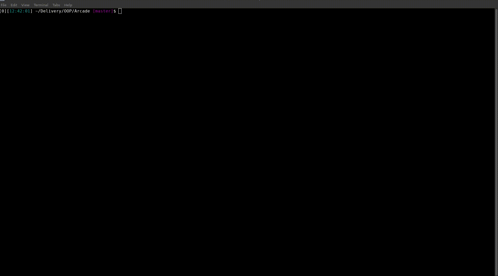

# Wanda Vision
#### Epitech's Arcade project

---

---

## Exemples

Here the nibbler game with our sfml display

## Documentation wiki like for users Is in great progress

## Documentation
- [Doxygen Documentation](https://octopus773.github.io/Wanda-Vision/)
- [ReadTheDoc documentation](https://wanda-vision.readthedocs.io/)

### Wanda Vision's contributors:
- [Zoe Roux](https://github.com/AnonymusRaccoon "Anonymus Raccoon")
- [Clément Le Bihan](https://github.com/Octopus773 "Octopus")

### Arcade project mates (common interfaces):
Group: Bad Nintendo
- [Arthur Jamet](https://github.com/Arthi-chaud "Arthi-Chaud")
- [Louis Auzuret](https://github.com/GitBluub "Bluub")
- [Ugo Généreau](https://github.com/ugenereau/)

Group: Capcom will learn from us (losers of the dice)
- [Baptiste Moulard](https://github.com/Arbarne "Arbane")
- [Romain Lucas](https://github.com/roromainlcs "roromainlcs")
- [Simon Thibaud](https://github.com/SimonTHD "SimonTHD")
