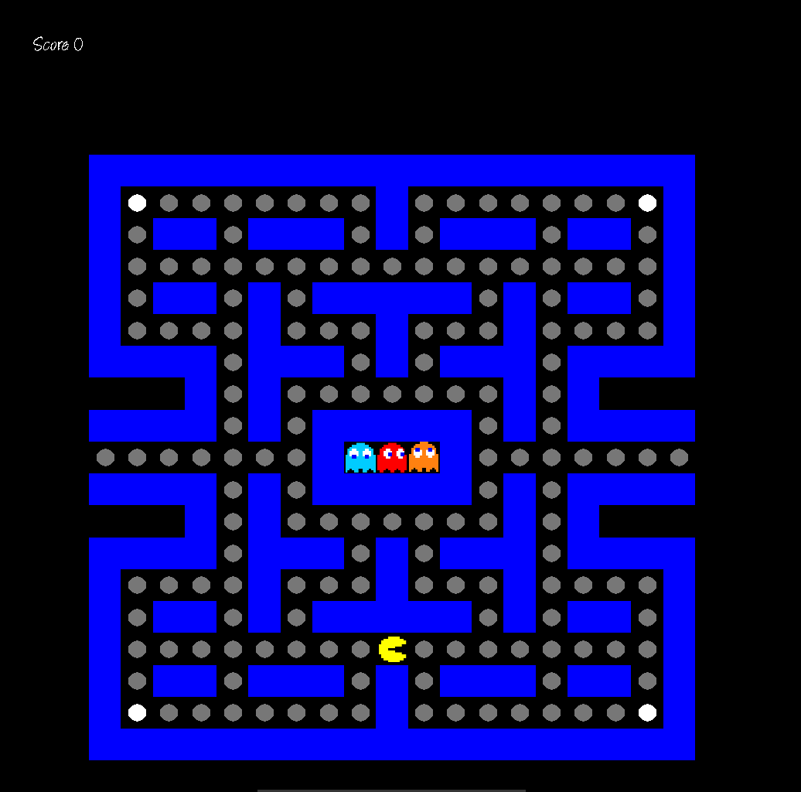

Exemples
##############

Here are some of our finished arcade

Pacman
--------

Qix
------

Here the unfinished qix game on sfml display

.. image:: assets/qix_sfml.png
  :alt: The qix game running on sfml display module

Nibbler and Display Differences
--------------------------------

Here the difference with the nibbler game between our three display modules

- SFML

    .. image:: assets/nibbler_sfml.png
        :alt: The snake game running on sfml display module
- SDL2

    .. image:: assets/nibbler_sdl2.png
        :alt: The snake game running on sdl2 display module
- NCURSES

    .. image:: assets/nibbler_ncurses.png
        :alt: The snake game running on ncurses display module